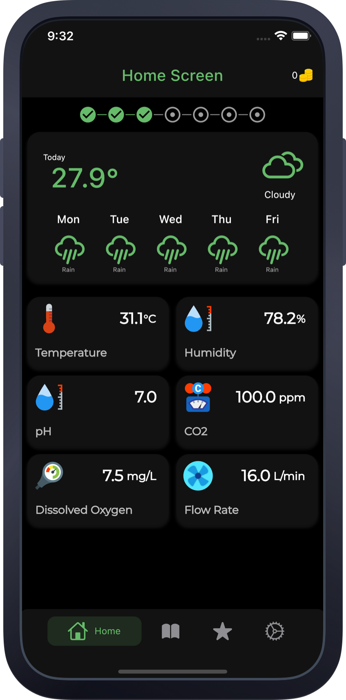

<h1 align="center">   GreenCrateSG</h1>
 🌱 Hydroponic System made by NUS students

## 🎆 Gallery

 

## 🚀 Features

<!-- 

<b>For All</b>

 -->

<!-- - ❌ No Ads!!! -->

- 📱 IoT Dashboard 
- ⛅ Weather 
- 📑 Wiki 
- ⭐ Reward 
- 🔔 Notification 
- 🎯 Light/Dark Mode 

## 🎗 Support

Liking this project?

- ⭐️ Star the repository
- 📲 Download the mobile apps (scroll to the top for links)
