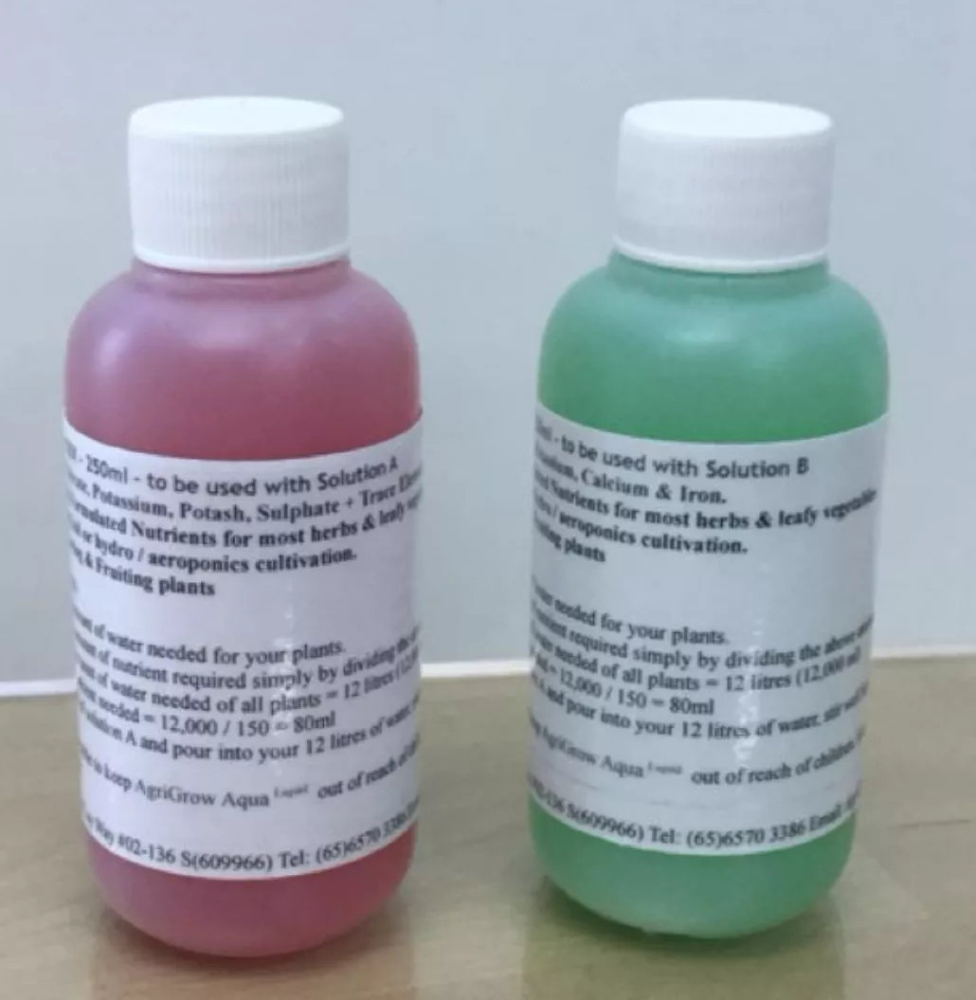

# Gemination Tutorial

## Overview Routine Per Harvest

Onboarding (1 day) `->` Germination (≈2 weeks) `->` Transference (1-2 days) `->` Hydroponics Growth and Monitiring (≈6 weeks) `->` Harvesting (1-2 days)

## Germination Procedure

1. Select your leafy greens seeds
2. Pour water up to half the height of container (About `392ml`)
3. Slot in grow pods into the cutouts of germination container
4. Place one sponge in each grow pod
5. Place 2-3 seeds into the sponge centre
6. Place germination setup in a warm area

## Nutrition

Product: [200x concentrated liquid fertiliser Hydroponics nutrient](https://www.lazada.sg/products/200x-concentrated-liquid-fertiliser-hydroponics-nutrient-mini-size-trial-size-liquid-fertilizer-for-leafy-vegetables-aromatic-herbs-aeroponics-and-aquaponics-i2269078831-s13087545387.html)

- 200:1 ratio will yield
- EC of ~ 1450uS/cm
- 28 degree celcius
- pH 6.15

### Nutrition for germination kit

- Add nutrition **only** `true leaves` have sprouted.

1. Pour the `1/3 of teaspoon` amount of `solution A` into water (`1.9594ml`)
2. Stir and mix
3. Pour the `1/3 of teaspoon` amount of `solution B` into water (`1.9594ml`)

### Nutrition for system
