# 🌱

## Leafy Vegetables

High in dietary fibre , vitamins , minerals and low in calories. A diet rich in leafy greens can offer health benefits such as reduced risk of obesity, heart disease and high blood pressure.

### Caixin

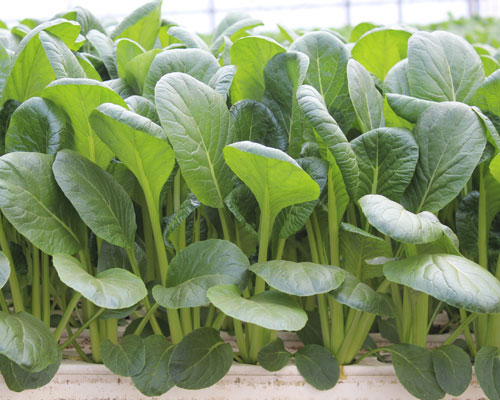

Caixin (Brassica rapa, Parachinensis Group) is a herbaceous annual. It takes three to five days to germinate, and 30 to 40 days to be ready for harvest.

- Vitamin A
- Vitamin C
- Vitamin K
- Anti-oxidants
- Anti-carcinogens

### Ceylon Spinach

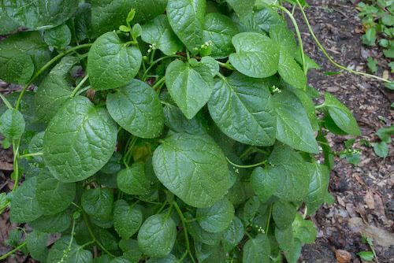

Ceylon Spinach (Basella alba) is a creeper. It takes about seven days to germinate, and 42 to 56 days to be ready for harvest.

- Vitamin A
- Vitamin C
- Magnesium
- Phosphorus
- Potassium
- Iron
- Protein
- Calcium.
- Anti-oxidants

### Chinese Mustard

Chinese Mustard (Brassica juncea) is a herbaceous annual. It takes three to five days to germinate, and about 40 days to be ready for harvest.

- Vitamin A
- Vitamin C
- Vitamin K
- Calcium
- Potassium
- Anti-oxidants

### Chinese Spinach

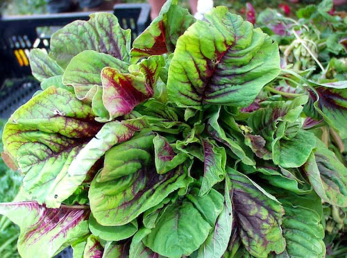

Also commonly known as Bayam, Chinese Spinach (Amaranthus tricolor),is grown throughout Southeast Asia. It is a herbaceous annual, and the bright red colour of its leaves is from antioxidants called betalains. It takes three to five days to germinate, and about 21 days to be ready for harvest.

- Vitamin A
- Vitamin B
- Vitamin C
- Calcium
- Iron
- Copper
- Magnesium
- Anti-oxidants

### Kailan

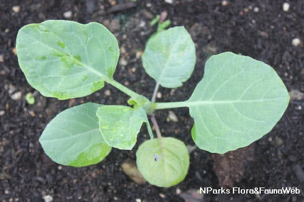

Kailan (Brassica oleracea, Alboglabra Group) is grown throughout Southeast Asia. It is a herbaceous annual. It takes three to five days to germinate, and 21 to 55 days to be ready for harvest.

- Vitamin A
- Vitamin C
- Vitamin K
- Calcium
- Anti-oxidants

### Kale

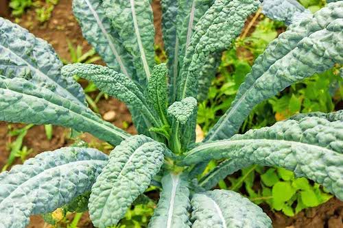

Kale (Brassica oleracea, Acephala Group ) is a herbaceous annual. There are many varieties of Kale – the leaves can be curly or smooth, and come in a range of colours, including purple, blue-green and even white. Do note that some varieties are ornamental, with tough and indigestible leaves. This plant takes three to five days to germinate, and about 35 days to be ready for harvest

- Vitamin A
- Vitamin B
- Vitamin C
- Vitamin K
- Calcium
- Potassium
- Copper
- Manganese
- Anti-oxidants

### Kang Kong

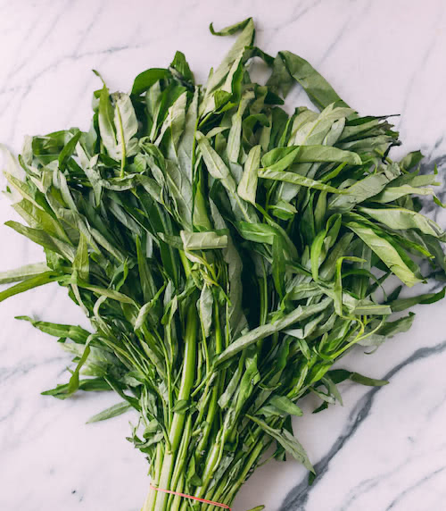

A member of the Morning Glory family, Kang Kong (Ipomoea aquatica) is a creeper. It is in the same genus as Sweet Potato. Kang Kong takes about three days to germinate, and about 21 days to be ready for harvest.

- Vitamin A
- Vitamin C
- Iron
- Calcium
- Magnesium
- Anti-oxidants

### Lettuce

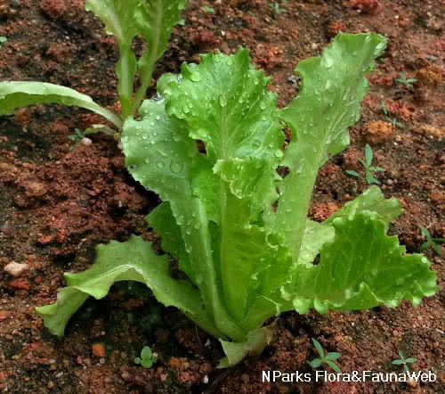

Lettuce (Lactuca sativa) belongs to the same family as the Sunflower and Daisy, and its flowers actually look similar to those of Daisy. It is a herbaceous annual. Lettuce takes about four days to germinate, and about 56 days to be ready for harvest.

- Vitamin A
- Vitamin C
- Vitamin E
- Vitamin K
- Iron
- Calcium
- Magnesium
- Potassium
- Anti-oxidants

### Sweet Potato

Sweet Potato (Ipomoea batatas) is a creeper. It can have tubers indifferent colours namely orange, white, yellow red or purple. This plant takes six to 15 days to germinate, and about 120 days to be ready for harvest. The leaves and shoots are also nutritious and often stir-fried or added to salads.

- Vitamin A
- Vitamin B
- Vitamin C
- Iron
- Calcium
- Zinc
- Magnesium
- Anti-oxidants
- Anti-carcinogens

### Xiao Bai Cai

Also known as Bok Choy, Xiao Bai Cai (Brassica rapa, Chinensis Group) is a herbaceous annual. There are two common varieties of this plant – one with green stems and another with white stems It takes about three days to germinate, and 40 to 45 days to be ready for harvest.

- Vitamin B
- Vitamin C
- Vitamin E
- Vitamin K
- Iron
- Calcium
- Zinc
- Magnesium
- Phosphorous
- Anti-oxidants

## Fruiting Vegetables

Fruiting Vegetables are those vegetables that produce edible fruits after flowering. High in dietary fibre , vitamins , minerals and low in calories. Eating fruiting vegetables can lower blood pressure, heart diseases and certain cancers.

### Bitter Gourd

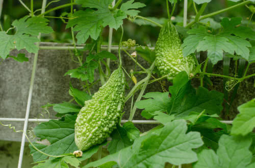

Depending on the variety, Bitter Gourd (Momordica charantia) may take 50 to 60 days to be ready for harvest.

- Vitamin A
- Vitamin C
- Iron
- Zinc
- Magnesium
- Phosphorous
- Anti-oxidants

### Brinjal

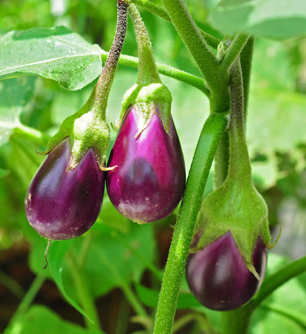

Brinjal (Solanum melongena) is a herbaceous shrub. It is also known as Eggplant because the first variety grown out of Asia produced a white, egg-shaped fruit. It takes about 14 days to germinate, and 105 to 133 days to be ready for harvest.

- Vitamin A
- Vitamin C
- Vitamin K
- Iron
- Calcium
- Magnesium
- Phosphorous
- Potassium
- Anti-oxidants

### Chilli

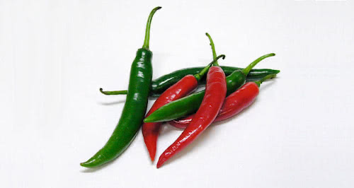

Chilli (Capsicum annuum) is actually the same species as cayenne pepper and bell pepper. It has a herbaceous growth form. It takes about 14 days to germinate, and 105 to 133 days to be ready for harvest.

- Vitamin A
- Vitamin B
- Vitamin C
- Vitamin K
- Potassium
- Copper
- Anti-oxidants

### Corn

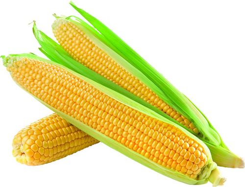

Corn (Zea mays) is a tall growing herbaceous growth form. There are many varieties of corn which produce kernels in different colours – black, bluish-grey, purple, green, red and even white! It takes four to six days to germinate, and 70 to 200 days to be ready for harvest.

- Vitamin B
- Vitamin C
- Vitamin E
- Vitamin K
- Magnesium
- Potassium
- Anti-oxidants

### Cucumber

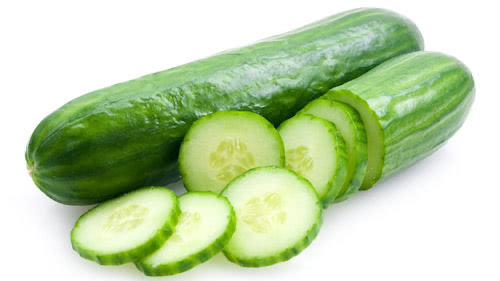

Grown throughout the tropics, Cucumber (Cucumis sativus) is a climber. It takes about three days to germinate, and 100 to 140 days to be ready for harvest.

- Vitamin A
- Vitamin C
- Vitamin K
- Iron
- Calcium
- Magnesium
- Potassium
- Manganese
- Anti-oxidants

### Lady's Finger

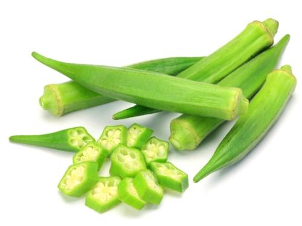

Related to Hibiscus, Lady’s-finger(Abelmoschus esculentus) is a herbaceous annual. The most common varieties produce green fruits, but there is also one that produces red fruits. This plant takes six to seven days to germinate, and 47 to 97 days to be ready for harvest.

- Vitamin A
- Vitamin B
- Vitamin C
- Vitamin K
- Potassium
- Calcium
- Magnesium
- Anti-oxidants

### Long Bean

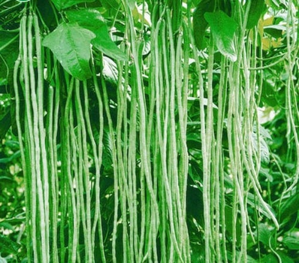

Long Bean (Vigna unguiculata) is a climber. This plant takes three to five days to germinate, and about 49 days to be ready for harvest.

- Vitamin B
- Vitamin C
- Vitamin E
- Vitamin K
- Iron
- Calcium
- Copper
- Magnesium
- Manganese
- Phosphorous
- Anti-oxidants

### Pumpkin

Pumpkin (Cucurbita moschata) is a climber that produces separate male and female flowers on the same plant. It takes about seven days to germinate, and 90 to 120 days to be ready for harvest.

- Vitamin A
- Vitamin B
- Vitamin C
- Vitamin E
- Vitamin K
- Iron
- Magnesium
- Copper
- Potassium
- Anti-oxidants

### Tomato

Tomato (Solanum lycopersicum) is a herbaceous annual. There are many cultivated varieties, with
cherry tomatoes being most commonly grown in Singapore. This plant takes about six days to germinate, and 77 to 105 days to be ready for harvest.

- Vitamin B
- Vitamin C
- Vitamin K
- Iron
- Zinc
- Magnesium
- Potassium
- Anti-oxidants

### Winter Melon

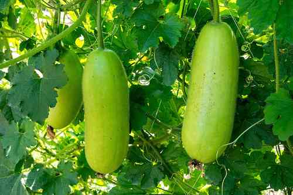

Winter Melon (Benincasa hispida) is a climber. It takes about seven days to germinate, and 90 to 120 days to be ready for harvest. The fruit has a wax coating that protects it from moisture loss.

- Vitamin B
- Vitamin C
- Iron
- Calcium
- Zinc
- Magnesium
- Manganese
- Phosphorous
- Potassium
- Anti-oxidants

## Culinary Herbs and Spices

Growing your own herbs and spices is a fun and practical way to produce fresh seasonings to your own cookings. They add flavor, aroma and visual appeal to your food. Though these plants are usually consumed in trace amounts, they also contain nutrients too!

### Chives

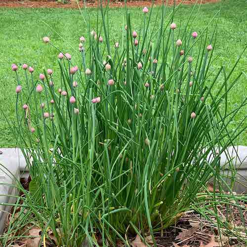

Chives (Allium tuberosum) grow well in fertile, loamy soil that drains well. To prevent excessive spreading of the plant, remove the flowers before it sets seed. This plant is hardy and resistant to most pests and diseases. The plant thrives in both full sun and semi-shade, and requires moderate watering. It can be propagated by division or seeds.

- Vitamin A
- Vitamin C
- Vitamin K
- Calcium
- Anti-oxidants

### Curry Leaf Plant

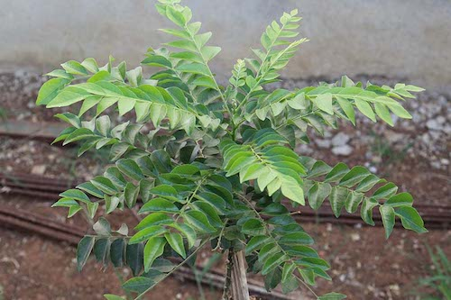

The Curry Leaf (Murraya koenigii) plant grows well in fertile, loamy soil that drains well. The plant thrives in full sun and requires moderate watering. It can be propagated by seeds, which can be obtained from mature seed pods. Sow seeds immediately after harvesting as they only remain viable up to three weeks. Their leaves produce a distinctive oil that is used to flavour and enhance the aroma of a wide variety of dishes including curries, dal, soups and snacks.

- Vitamin A
- Vitamin C
- Magnesium
- Manganese
- Zinc
- Iron
- Phosphorus
- Calcium
- Anti-oxidants

### English Mint

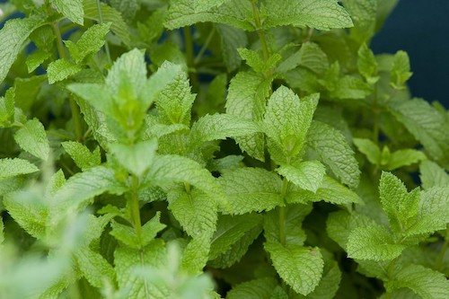

The English Mint (Mentha spicata) is tolerant of most soil types, but thrives in moise soil. It is susceptible to aphids, rust and powdery mildew. They thrive in both full sun and semi-shade, and requires moderate watering. It can be propagated by division, seeds or stem cuttings. It's leaves can be used raw in salads, as a garnish or add flavours to teas, desserts and sauces if boiled.

- Vitamin A
- Vitamin C
- Magnesium
- Iron
- Potassium
- Calcium
- Anti-oxidants

### Indian Borage

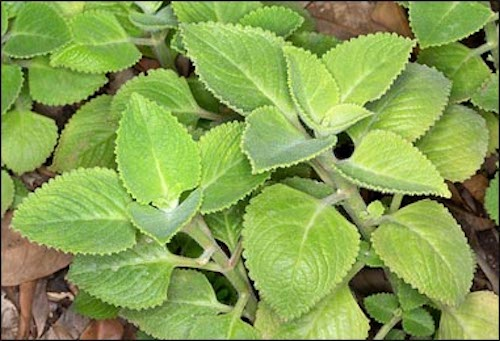

The Indian Borage (Plectranthus amboinicus) required sandy soil that drains well. It grows quickly, but its stems are susceptible to breakage. The plant thrives in semi-shade and requires moderate watering. It can be propagated by stem cuttings. Their leaves can be used to add flavour to meat and bean dishes, especially in Caribbean cuisine. Their flavour is described as being a combination of thyme and oregano.

- Vitamin A
- Vitamin C
- Magnesium
- Iron
- Zinc
- Copper
- Sodium
- Potassium
- Anti-oxidants

### Laksa

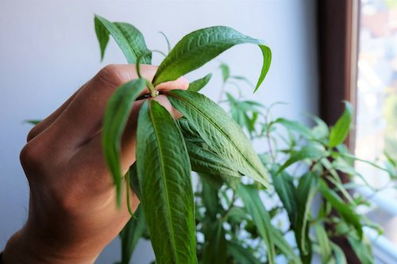

Laksa (Persicaria odorata), also known as Daun Kesum in the Malay community is commonly added to the signature local dish _laksa_ . It grows best in well-draining soil that is kept consistently moist. It can be grown indoors on a sunny windowsill. This plant thrives in both full sun and semi-shade and needs lots of water. It can be propagated by seeds or stem cuttings.

- Vitamin A
- Vitamin B
- Vitamin C
- Magnesium
- Iron
- Sodium
- Phosphorus
- Copper
- Zinc
- Calcium
- Anti-oxidants

### Lemongrass

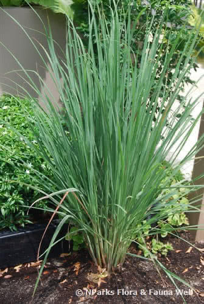

Lemongrass (Cymbopogon citratus) grows quickly and produces many stalks if grown in full sunlight. It prefers moist, well-draining loamy soils, but will tolerate most soil types. The plant can be divided into clusters , with each cluster planted in different areas. This plant thrives in full sunlight and requires moderate watering.

- Vitamin A
- Vitamin C
- Iron
- Calcium
- Potassium
- Manganese
- Magnessium
- Anti-oxidants

### Pandan

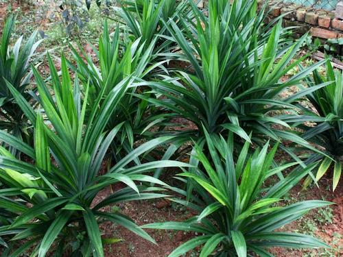

Pandan (Pandanus amaryllifolius) is a very common and easily grown plant in Singapore , where it flourishes naturally on slopes with moist soil. To maintain the plant as a shrub , regularly harvest the leaves and water generously. This species is susceptible to the Pandanus Mealybug (Laminococcus panddani). This plant thrives in semi-shade and needs lots of water. It can be propagated by division. Their leaves can be steamed to extract the juice, which can add fragrance to teas, desserts and even jams.

- Vitamin A
- Vitamin C
- Iron
- Calcium
- Phosphorus
- Anti-oxidants

### Sawtooth Coriander

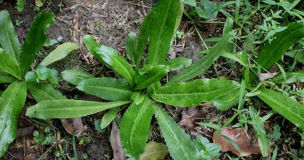

Sawtooth Coriander (Eryngium foetidum) grows well in sandy loamy soil that drains well. It is hardy and resistant to most pests and diseases. The plant thrives well in both full sun and semi-shade, and requires moderate watering. It can be propagated by division or seeds. The leaves have a similar but stronger flavour than Coriander (Coriandrum sativum), and are used similarly in soups and stir-fries.

- Vitamin C
- Vitamin K
- Iron
- Calcium
- Manganese
- Magnessium
- Anti-oxidants

### Thai Basil

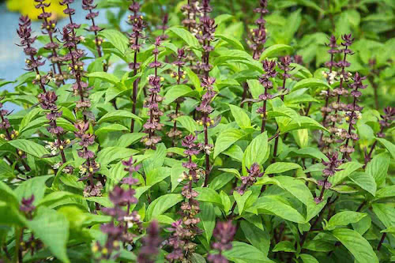

Thai Basil (Ocimum basilcum) grows best in a full sun and semi-shade location with fertile soil that drains well. It can be grown indoors if it receives at least six hours of sunlight each day. It also requires moderate watering and can be propagated by seeds or stem cuttings. The leaves can be used in soups or stir-fried with meat.

- Vitamin A
- Vitamin C
- Iron
- Calcium
- Sodium
- Potassium
- Anti-oxidants

### Turmeric

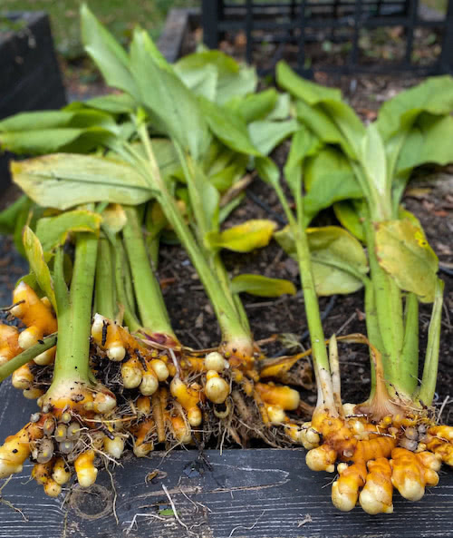

Turmeric (Curcuma onga) grows well in fertile, loamy soil that drains well. It thrives in both full sun and semi-shade, and requires lots of water. It can be propagated by division. The rhizomes can be used in soups, curry bases and teas . Its leaves can also be used to wrap fish paste to give a pleasant scent to the dish.

- Vitamin B
- Vitamin C
- Vitamin D
- Iron
- Calcium
- Potassium
- Manganese
- Anti-oxidants

## Credits

CaiXin - http://www.cherryfarms.co.uk/choisum.html

Ceylon Spinach - https://www.iplantz.com/plant/203/basella-alba/

Chinese Mustard - https://www.nparks.gov.sg/florafaunaweb/flora/5/9/5940

Chinese Spinach - https://gardenofeaden.blogspot.com/2014/02/how-to-grow-chinese-spinach-from-seed.html

Kailan - https://www.nparks.gov.sg/florafaunaweb/flora/7/1/7137

Kale - https://gardenerspath.com/plants/vegetables/harvest-kale/

Kang Kong - https://thewoksoflife.com/chinese-water-spinach/

Lettuce - https://www.nparks.gov.sg/florafaunaweb/flora/5/9/5959

Sweet Potato - https://www.nparks.gov.sg/florafaunaweb/flora/1/4/1423

Xiao Bai Cai - https://www.nparks.gov.sg/florafaunaweb/flora/6/5/6525

Bitter Gourd - https://balconygardenweb.com/how-to-grow-bitter-melon-growing-bitter-gourd-in-pots/

Brinjal - https://en.wikipedia.org/wiki/Eggplant

Chili - https://www.macmillandictionary.com/dictionary/british/chilli

Corn - https://www.nutritionletter.tufts.edu/general-nutrition/harvesting-the-health-benefits-from-corn/

Cucumber - https://chefsmandala.com/archaeology-fruits-vegetables-cucumber/

Lady's Finger - https://www.indiatimes.com/health/tips-tricks/why-you-should-eat-lady-finger-regularly-237468.html?picid=916968

Long Bean - https://www.agrifarming.in/yard-long-beans-farming-cultivation

Pumpkin - https://www.healthxchange.sg/food-nutrition/food-tips/pumpkin-health-benefits-nutrition-facts

Tomato - https://www.thespruce.com/growing-tomatoes-1403296

Winter Melon - https://www.thespruceeats.com/chinese-winter-melon-overview-694718

Chives - https://sproutedgarden.com/chives/

Curry Leaf Plant - https://gardenerspath.com/plants/herbs/grow-curry-leaf/

English Mint - https://www.gardenersworld.com/plants/mentha-spicata-english-lamb/

India Borage - https://www.planetayurveda.com/library/indian-borage-plectranthus-amboinicus/

Laksa - https://carryitlikeharry.com/laksa-leaves/

Lemongrass - https://www.nparks.gov.sg/florafaunaweb/flora/1/9/1918

Pandan - https://gardendrum.com/2017/10/04/grow-use-pandan/

Sawtooth Coriander - https://organicmotion.com.au/tropical-coriander/

Thai Basil - https://gardenerspath.com/plants/herbs/grow-thai-basil/

Turmeric - https://www.theimpatientgardener.com/turmeric/
